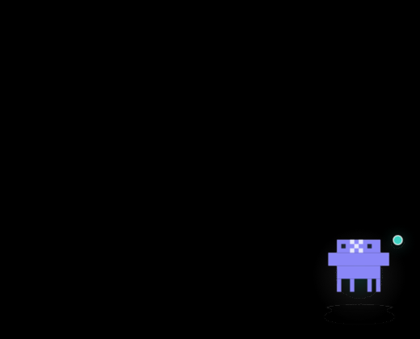

# AgentPets

AgentPets is a small macOS companion for Claude Code and Codex. It watches your local agent sessions and shows their state through a draggable pixel robot, a menu bar item, and optional Touch Bar support.

AgentPets 是一个面向 Claude Code 和 Codex 的 macOS 桌面小助手。它会在本机监控你的 Agent 会话状态，并用一个可拖动的像素机器人、菜单栏状态项和可选 Touch Bar 展示出来。



Floating desktop robot preview / 桌面悬浮机器人效果图

## What It Does

- Shows whether Claude or Codex is idle, listening, thinking, working, successful, errored, or offline.
- Automatically switches the pet style between Claude and Codex based on the active detected agent.
- Aggregates multiple terminal/IDE agent sessions into a task list.
- Lets you click a task to return to the matching terminal or app window.
- Runs as a background accessory app, so it does not take a Dock slot.
- Keeps everything local. There is no server component and no cloud sync.

## 项目用途

- 展示 Claude 或 Codex 当前是空闲、监听、思考、工作、成功、出错还是离线。
- 根据检测到的活跃 Agent，自动在 Claude 和 Codex 像素机器人之间切换。
- 将多个终端或 IDE 里的 Agent 会话聚合成任务列表。
- 点击任务状态即可切回对应的终端或应用窗口。
- 作为后台辅助应用运行，不占用程序坞位置。
- 所有状态处理都在本机完成，没有服务端，也不会做云同步。

## Experience

AgentPets normally appears as a compact floating robot near the edge of the desktop. Click the pet to expand a clean task list. The menu bar item gives quick access to task status, pack selection, preferences, and quit controls. When Touch Bar support is enabled, the same state can also be mirrored there.

The visual style is intentionally minimal: Claude and Codex are represented by related but distinct pixel robots, with state changes shown through small animations and status accents.

## 效果说明

AgentPets 默认显示为桌面边缘的一个小型悬浮像素机器人。点击机器人后会展开任务列表。菜单栏图标可以快速查看任务状态、切换机器人包、打开偏好设置或退出应用。如果启用 Touch Bar，也可以把同样的状态同步显示到 Touch Bar。

整体效果偏简洁：Claude 和 Codex 使用同一风格家族但细节不同的像素机器人，通过轻量动画和状态点来表达当前任务状态。

## Download

Download the latest DMG from GitHub Releases:

https://github.com/puppet4/AgentPets/releases/latest

Open the DMG, drag `AgentPets.app` into `Applications`, then launch it.

## 下载安装

从 GitHub Releases 下载最新 DMG：

https://github.com/puppet4/AgentPets/releases/latest

打开 DMG 后，把 `AgentPets.app` 拖到 `Applications`，然后启动应用。

## Build From Source

```bash
swift build
```

## Run Tests

```bash
swift test --disable-sandbox
```

## Install Locally With Hooks

For local development, this script builds the app, installs `pet-notify`, and merges Claude/Codex hook configuration:

```bash
bash scripts/build-and-install.sh
```

## Package a DMG

```bash
bash scripts/build-dmg.sh
```

The generated DMG is written to `dist/` and is intentionally ignored by git.

## 本地开发

构建：

```bash
swift build
```

测试：

```bash
swift test --disable-sandbox
```

本地安装并写入 Claude/Codex hooks：

```bash
bash scripts/build-and-install.sh
```

打包 DMG：

```bash
bash scripts/build-dmg.sh
```

生成的 DMG 会放在 `dist/`，不会提交到 git。

## Privacy

AgentPets reads local process and hook state only to display session status. It does not send your prompts, task names, or files to any remote service.

## 隐私说明

AgentPets 只读取本机进程和 hook 状态，用于展示会话进度。它不会把你的提示词、任务标题或文件发送到远端服务。
